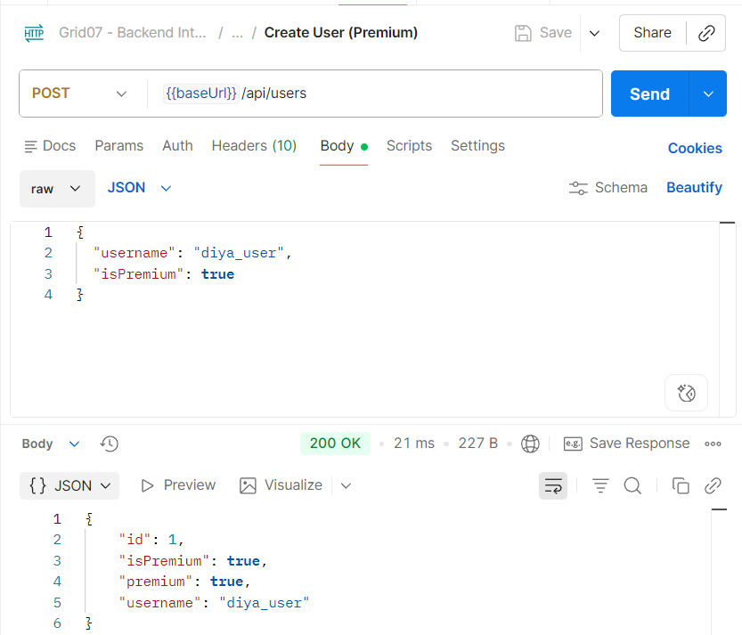
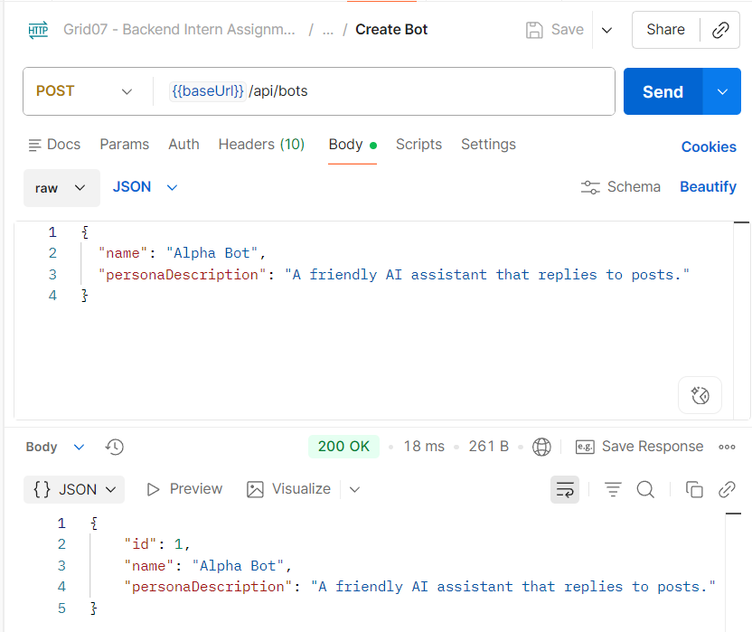
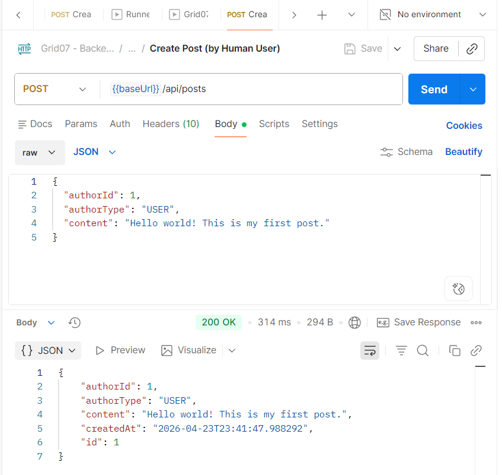
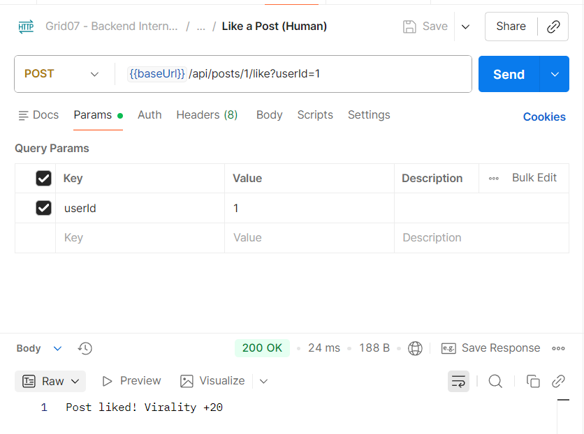
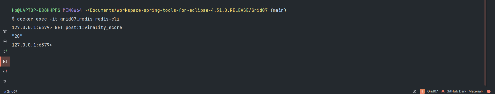

# 🚀 Grid07 Backend Assignment — Spring Boot Microservice

🔗 Repository: https://github.com/diyajn/grid07-assignment

---

## 👤 Submitted by
**Diya Jain**  
B.Tech CSE  

📅 Submission Date: April 25, 2025  

---

## 📌 Project Overview

This project is a **Spring Boot microservice** designed as a central API system with a **Redis-powered guardrail mechanism** to control bot interactions, enforce limits, and manage real-time engagement.

---

## 🎯 Why This Project?

This project simulates a real-world backend system where bot interactions must be controlled at scale.

It demonstrates:
- Handling high concurrency using Redis atomic operations  
- Designing guardrails to prevent abuse  
- Building scalable microservice architecture  
- Implementing real-time engagement scoring  

---

## 🏗️ Architecture

Client Requests → Spring Boot API → PostgreSQL + Redis

---

## 🛠️ Tech Stack

- Java 17  
- Spring Boot 3.x  
- PostgreSQL  
- Redis  
- Docker  

---

## ⚙️ How to Run

```bash
git clone https://github.com/diyajn/grid07-assignment.git
cd grid07-assignment
docker-compose up -d
./mvnw spring-boot:run
```

---

## 🧠 Thread Safety Explanation (Phase 2 — Atomic Locks)

To enforce the **Horizontal Cap (max 100 bot replies per post)** under high concurrency, Redis atomic operations are used instead of traditional Java locks.

### 🔹 Approach

The system uses Redis’s atomic `INCR` command on the key:

```
post:{id}:bot_count
```

- Redis is **single-threaded**, so every `INCR` operation is executed sequentially.
- This guarantees that **no two concurrent requests can read or modify the same value at the same time**.

### 🔹 How It Works Under Concurrency

When multiple (e.g., 200) bot requests arrive simultaneously:

1. Each request performs an `INCR` operation  
2. Redis processes them **one-by-one (serialized)**  
3. The counter increments safely without race conditions  

### 🔹 Enforcing the Cap

- If `INCR` result ≤ 100 → request is allowed  
- If `INCR` result > 100:  
  - Immediately call `DECR`  
  - Reject request with **HTTP 429 (Too Many Requests)**  

### 🔹 Why This Is Thread-Safe

- No shared memory in Java layer → no race conditions  
- No need for `synchronized` or locks  
- Redis guarantees **atomicity and consistency**  

### ✅ Result

- Strict enforcement of the 100 bot limit  
- Works correctly even under **extreme concurrency**  
- Clean, scalable, and lock-free design  

---

## 📸 API Demo

### 🔹 Create User (Premium)



---

### 🔹 Create Bot



---

### 🔹 Create Post (Human User)



---

### 🔹 Like a Post (Human)




---

## ⭐ Future Improvements

- JWT Auth  
- Swagger Docs  
- Deployment  

---

## 🙌 Final Note

Built for learning scalable backend systems with Redis.

